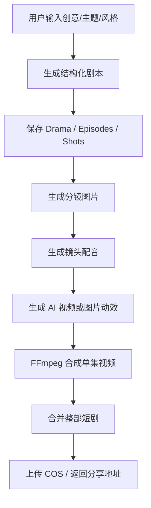
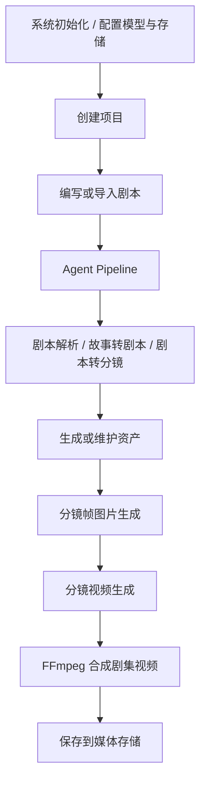
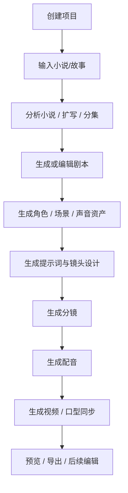
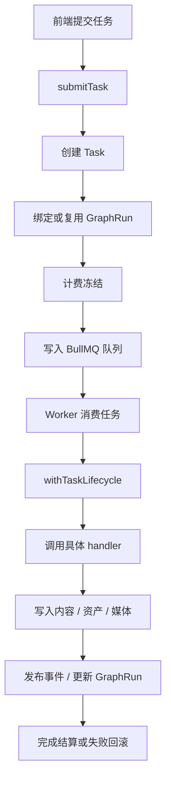

# 三个 AI 视频创作项目详细介绍与工作流分析

> 分析对象：
>
> - [ycbing/Shortify-AI](https://github.com/ycbing/Shortify-AI)
> - [Stonewuu/ai-fusion-video](https://github.com/Stonewuu/ai-fusion-video)
> - [waooAI/waoowaoo](https://github.com/waooAI/waoowaoo)
>
> 分析日期：2026-06-27  
> 分析依据：GitHub 仓库 main 分支的 README、依赖配置、Docker 配置、数据库 schema、核心 API、任务队列、Worker 和视频合成相关源码。  
> 说明：本文为源码与配置层面的静态分析，未在本地启动三个项目，也未真实调用外部 AI API。

## 1. 总体结论

这三个项目都属于 AI 视频或 AI 短剧创作工具，但产品定位、工程架构和工作流复杂度差异很大。

| 项目 | 核心定位 | 技术形态 | 工作流风格 | 适合场景 |
|---|---|---|---|---|
| Shortify-AI | AI 短剧一体化生成平台 | Next.js 单体应用 | 创意到成片的线性闭环 | 个人创作者、小团队、快速 Demo |
| ai-fusion-video | 基于 Agent 的 AI 视频创作平台 | Java 后端 + Next.js 前端 | 项目管理 + Agent Pipeline + 队列生成 | 想做平台化、可控式 AI 视频生产 |
| waoowaoo | 工业级 AI 影视 Studio | Next.js + Prisma + BullMQ + GraphRun | 分阶段工作台 + 任务编排 + 可恢复长流程 | 复杂影视生产、长链路、资产沉淀 |

简单理解：

- **Shortify-AI** 更像“一句话创意生成短剧”的产品。
- **ai-fusion-video** 更像“带 Agent 的视频创作平台后台”。
- **waoowaoo** 更像“完整 AI 影视生产工作台”，内部任务、资产、图运行时、计费和恢复机制都更重。

---

## 2. ycbing/Shortify-AI

### 2.1 项目定位

Shortify-AI 是一个 AI 短剧创作平台，目标是让用户输入一个创意、主题或故事方向，然后由系统自动完成：

1. 剧本生成
2. 角色设定
3. 分镜拆解
4. 分镜图片生成
5. 多角色配音
6. 视频合成
7. 字幕与 BGM
8. 成片导出和分享

它的产品目标很明确：**把 AI 短剧生产压缩成一个相对自动化的闭环**。相比后两个项目，Shortify-AI 的工程组织更轻，流程更直线，用户理解成本也更低。

### 2.2 技术栈

Shortify-AI 主要采用：

- 前端与服务端：Next.js 16 App Router
- UI：React 19、Tailwind CSS v4、shadcn/ui
- 数据库：PostgreSQL
- ORM：Drizzle
- 登录认证：NextAuth v5
- 文本模型：GLM、DeepSeek、Qwen 等
- 图像模型：Wan、CogView、Wanx 等
- 视频模型：CogVideo、Kling、LibLib 等
- 配音：讯飞 TTS、Edge TTS
- 视频处理：FFmpeg
- 对象存储：腾讯云 COS
- 部署：Docker Compose、PM2、Nginx

从架构上看，它是一个典型的 **Next.js 全栈单体应用**。前端页面、API routes、数据库访问、AI 调用、视频合成都放在同一个项目体系里。

### 2.3 数据模型

Shortify-AI 的数据结构围绕“短剧”展开：

- `users`：用户表
- `userPasswords`：密码认证信息
- `dramas`：短剧项目
- `episodes`：剧集
- `usageLogs`：积分使用记录
- `generationTasks`：生成任务状态
- `verificationTokens`：邮箱验证或认证 token

其中最关键的是：

- `dramas` 表记录短剧整体信息，例如主题、类型、风格、集数、状态、封面、BGM、最终合并视频、画幅、分享 token、角色信息。
- `episodes` 表记录每一集的信息，例如剧本文本、旁白文本、图片、配音、视频、时长、分镜数据、字幕地址。
- `shotData` 是非常重要的字段，用来保存每集内部的镜头数组。后续的图像生成、配音、视频生成都围绕这些镜头执行。

因此，Shortify-AI 的内容结构是：

```text
Drama 短剧
  -> Episode 剧集
      -> Shot 镜头
          -> image / voiceover / video / subtitle
```

### 2.4 核心功能

Shortify-AI 的核心功能可以拆成七类。

第一类是 **AI 编剧**。用户输入主题、类型、风格和集数后，系统调用大语言模型生成结构化短剧。生成结果包含角色、剧集、镜头、对白、旁白、画面描述和声音设定。

第二类是 **角色与镜头一致性控制**。脚本生成器要求角色有外观描述、性格、声音设定，并在镜头图像提示词里尽量保持一致。第一集生成角色参考图后，后续镜头会继续使用角色外观描述。

第三类是 **分镜图片生成**。系统按每个镜头生成画面图，并把图片地址写回 `shotData`。如果配置了 COS，会上传到对象存储。

第四类是 **多角色配音**。系统根据每个镜头的对白和旁白生成音频，并记录时长。音频时长会影响后续视频片段长度。

第五类是 **视频生成**。如果配置了视频生成服务，系统会用分镜图生成 AI 视频；如果没有生成成功，则可以用图片做 Ken Burns 动效作为兜底。

第六类是 **FFmpeg 合成**。系统把镜头视频或图片动效、配音、字幕、BGM 合成单集视频，再进一步合成整部短剧。

第七类是 **积分、任务和分享**。生成脚本、图片、语音、视频都会消耗积分；任务有状态、心跳、取消和失败退款逻辑；最终视频可上传 COS 并生成分享地址。

### 2.5 工作流方式

Shortify-AI 的工作流是比较线性的，适合“一步一步把创意变成视频”。



具体步骤如下：

1. 用户注册或登录。
2. 用户创建一个短剧项目，填写主题、类型、风格、集数、画幅等。
3. 系统创建 `drama` 记录，初始状态通常为 draft 或 generating。
4. 调用 `/api/generate/script` 生成剧本。
5. 剧本生成后，系统把角色信息写入 `dramas.characters`，把每集写入 `episodes`，把镜头数组写入 `shotData`。
6. 调用 `/api/generate/storyboard` 为每个镜头生成图片。
7. 第一集会尝试生成角色参考图，后续分镜提示词会叠加角色外观描述。
8. 图片生成后写回镜头数据，并可上传到 COS。
9. 调用 `/api/generate/voiceover` 为每个镜头生成配音。
10. 每条配音会记录本地路径、远程 URL 和音频时长。
11. 如果开启自动合成，系统会继续生成视频。
12. 调用 `/api/generate/video` 或内部合成函数处理每个镜头。
13. 有 AI 视频时使用 AI 视频；没有 AI 视频时使用图片加 Ken Burns 动效。
14. `video-composer` 用 FFmpeg 拼接镜头、添加字幕、混合 BGM。
15. 单集视频生成后写回 `episodes.videoUrl`。
16. 所有剧集完成后，生成整部短剧合并视频，更新 `dramas.status = completed`。
17. 用户在作品管理页查看、播放或分享。

### 2.6 任务与积分机制

Shortify-AI 有比较完整的任务控制：

- 同一短剧不能无限并发生成。
- `generationTasks` 记录当前任务状态。
- 任务有 heartbeat，可判断长任务是否仍在运行。
- 用户取消任务时，系统可以停止后续流程。
- 生成失败时会根据结果进行积分退还。
- 每类生成任务可以有不同积分成本。

这使它比普通 Demo 更接近可用产品。

### 2.7 优点与局限

优点：

- 工作流清晰，用户很容易理解。
- Next.js 单体应用部署成本相对较低。
- 从剧本、图片、语音到视频合成形成闭环。
- 数据模型简单直接，适合二次开发。
- FFmpeg 兜底机制实用，不完全依赖 AI 视频模型成功率。

局限：

- 更偏单人或小团队短剧生产，不是复杂影视工业流程。
- Agent 化能力不如 ai-fusion-video。
- 长流程可恢复能力不如 waoowaoo。
- 离线全流程脚本目前更像内部批处理工具，通用性需要再封装。

---

## 3. Stonewuu/ai-fusion-video

### 3.1 项目定位

ai-fusion-video 又名“融光”，定位是 **基于 Agent 的全流程 AI 短剧、漫剧、视频创作平台**。

它不是单纯的一键生成器，而是把视频创作拆成：

1. 项目管理
2. 剧本管理
3. AI 剧本辅助
4. AI 分镜
5. 资产管理
6. 图片生成
7. 视频生成
8. 分镜视频合成
9. 多模型配置
10. 多存储后端
11. Agent Pipeline 可视化

它的工程风格明显更偏平台化和后端服务化。

### 3.2 技术栈

后端：

- Java 21
- Spring Boot 3.5
- Spring AI
- MyBatis Plus
- MySQL
- Redis
- Flyway
- Spring Security
- WebFlux
- Springdoc OpenAPI
- MapStruct
- 多 AI Provider SDK

前端：

- Next.js 16
- React 19
- TypeScript
- Ant Design X
- shadcn/ui
- Zustand
- Three.js
- Framer Motion

部署：

- Docker Compose
- MySQL 8
- Redis 7
- Nginx
- 后端与前端容器分离

与 Shortify-AI 相比，它采用 **Java 后端 + Next.js 前端** 的分层架构，更适合做成长期维护的平台服务。

### 3.3 数据与业务模块

从源码目录和数据库迁移看，它的业务对象包括：

- 用户、角色、权限
- 团队、团队成员
- 项目、项目成员
- 剧本、剧集、场景
- 分镜、分镜剧集、分镜场景、分镜项
- 资产、资产项
- 图片任务、图片任务项
- 视频任务、视频任务项
- AI 模型配置
- API 配置
- Agent 会话与消息
- 系统配置

其中分镜项字段非常丰富，包括：

- 镜号
- 图片 URL
- 视频 URL
- 生成图片 URL
- 生成视频 URL
- 景别
- 时长
- 内容描述
- 场景预期
- 声音
- 对白
- 镜头运动
- 镜头角度
- 摄影设备
- 焦距
- 转场
- 角色 ID
- 场景资产 ID
- 道具 ID
- 视频提示词

这说明它对“可控分镜”非常重视。

### 3.4 Agent Pipeline

ai-fusion-video 的核心特色是 Agent Pipeline。

源码中 `AiAgentRegistry` 注册了多个 Agent，例如：

- 默认 AI 媒体助手
- 概念视觉化 Agent
- 完整剧本解析 Agent
- 故事转剧本 Agent
- 剧集脚本解析 Agent
- 剧本助手 Agent
- 剧本转分镜 Agent
- 资产图片生成 Agent
- 分镜帧生成 Agent
- 分镜视频生成 Agent

部分 Agent 还会挂子 Agent，例如：

- `script_full_parse` 下有剧集场景写作子 Agent。
- `story_to_script` 下有剧集脚本创建子 Agent。
- `script_to_storyboard` 下有资产预处理和剧集分镜写作子 Agent。
- `asset_image_gen` 下有图片执行子 Agent。
- `storyboard_video_gen` 下有视频执行子 Agent。

这些 Agent 会使用工具，例如：

- 查询项目
- 查询剧本
- 查询资产
- 查询分镜
- 保存剧集
- 保存场景
- 生成图片
- 生成视频
- 更新资产
- 更新分镜项

因此它的 AI 不只是“返回一段文本”，而是可以在项目上下文中读写业务数据。

### 3.5 任务队列与生成策略

ai-fusion-video 的生成任务不是直接同步执行，而是进入 Redis 队列。

图片生成队列示例：

```text
image_generation:model:{modelId}
```

视频生成队列示例：

```text
video_generation:model:{modelId}
```

这种设计有两个好处：

1. 不同模型可以有不同并发上限。
2. 任务调度和模型能力可以分开管理。

`ImageGenerationConsumer` 和 `VideoGenerationConsumer` 会定时从队列取任务，选择对应策略执行。

支持的策略包括：

- DashScope
- OpenAI
- Volcengine
- Google / VertexAI
- Google Flow Reverse API
- NewAPI
- Kling
- Sora
- Jimeng
- 通用协议

这使它具备比较强的多模型接入能力。

### 3.6 工作流方式

ai-fusion-video 的工作流不是简单线性，而是“项目驱动 + Agent 辅助 + 队列执行”。



具体步骤如下：

1. 部署系统后进行初始化。
2. 配置数据库、Redis、存储和 AI 模型。
3. 用户登录后创建项目。
4. 在项目中创建或导入剧本。
5. 剧本可以按剧集和场景管理。
6. 用户可以手动编辑剧本，也可以调用 Agent Pipeline。
7. Agent Pipeline 通过 `/api/ai/pipeline/run` 启动。
8. 后端用 SSE 向前端持续返回执行状态。
9. Agent 根据任务类型选择工具和子 Agent。
10. 例如故事转剧本、剧本转分镜、分镜图生成、视频生成等。
11. 图片或视频生成任务进入 Redis 队列。
12. Consumer 根据模型 ID 和并发配置取任务。
13. 具体策略类调用外部模型服务。
14. 生成结果保存到本地、OSS、COS、MinIO 或 S3。
15. 生成结果写回图片任务、视频任务、资产或分镜项。
16. 分镜项视频完成后，`VideoComposeService` 收集所有视频片段。
17. 系统用 FFmpeg 拼接为剧集视频。
18. 剧集视频保存到媒体存储，并更新合成状态。

### 3.7 优点与局限

优点：

- 后端架构更成熟，适合平台化部署。
- Agent Pipeline 设计清晰，有工具调用和子 Agent。
- 图片、视频任务队列按模型拆分，便于并发控制。
- 多模型、多存储支持丰富。
- 分镜字段细，适合可控视频生成。

局限：

- 系统复杂度高于 Shortify-AI。
- Java 后端 + Next 前端对部署和二开要求更高。
- 更像创作平台，不是最轻量的一键短剧工具。
- 长任务恢复、图式工作流和计费体系不如 waoowaoo 那么重。

---

## 4. waooAI/waoowaoo

### 4.1 项目定位

waoowaoo 定位是工业级 AI 影视生产平台，目标是服务从短剧、漫剧到真人影视的可控生产。

它与前两个项目相比，最突出的特点是：

- 工作台阶段更完整
- 资产体系更复杂
- 任务类型更多
- BullMQ Worker 更系统
- GraphRun 可记录长流程
- 有计费、冻结、回滚等生产化逻辑
- 有全局 Asset Hub
- 支持更复杂的可恢复流程

它不是只想做“生成一个视频”，而是想做“影视生产操作系统”。

### 4.2 技术栈

waoowaoo 主要采用：

- Next.js 15
- React 19
- TypeScript
- Prisma
- MySQL
- Redis
- BullMQ
- NextAuth
- MinIO / S3 / COS
- Tailwind CSS v4
- Remotion
- sharp
- OpenAI / Google / OpenRouter / fal-ai 等模型接入

部署时通常需要：

- MySQL
- Redis
- MinIO
- App 服务
- Worker
- Watchdog
- Bull Board

这说明它不是一个单进程 Demo，而是一个多组件生产系统。

### 4.3 数据模型

waoowaoo 的 Prisma schema 非常丰富，可以分成几组。

用户与认证：

- `User`
- `Account`
- `Session`
- `VerificationToken`
- `UserPreference`

项目与内容：

- `Project`
- `NovelPromotionProject`
- `NovelPromotionEpisode`
- `Clip`
- `Shot`
- `Storyboard`
- `Panel`
- `SupplementaryPanel`
- `VoiceLine`
- `VideoEditorProject`

资产体系：

- `GlobalAssetFolder`
- `GlobalAssetCharacter`
- `GlobalAssetCharacterAppearance`
- `GlobalAssetLocation`
- `GlobalAssetLocationImage`
- `GlobalAssetVoice`
- `NovelPromotionCharacter`
- `NovelPromotionLocation`
- `NovelPromotionLocationImage`
- `MediaObject`

任务系统：

- `Task`
- `TaskEvent`

图运行时：

- `GraphRun`
- `GraphStep`
- `GraphStepAttempt`
- `GraphEvent`
- `GraphCheckpoint`
- `GraphArtifact`

计费系统：

- `UsageCost`
- `UserBalance`
- `BalanceFreeze`
- `BalanceTransaction`

可以看出，waoowaoo 的核心不是单一视频生成，而是“项目 + 资产 + 分镜 + 任务 + 图运行时 + 计费”的组合。

### 4.4 用户侧工作台

waoowaoo 的工作台主要围绕小说/短剧推广类项目展开。典型阶段包括：

1. Novel Input：输入小说或故事文本。
2. Script：生成或编辑剧本。
3. Assets：生成和维护角色、场景、声音等资产。
4. Prompts：维护提示词和镜头描述。
5. Storyboard：生成分镜。
6. Voice：生成配音。
7. Video：生成视频。

此外还有 Asset Hub，用于跨项目管理全局资产：

- 全局角色
- 全局场景
- 全局声音
- 文件夹
- 资产图片设计
- 资产声音设计

这让它比 Shortify-AI 更强调资产复用。

### 4.5 任务类型

waoowaoo 的任务类型非常多，说明它把复杂影视生产拆成了大量细粒度任务。

典型任务包括：

- 小说分析
- 故事扩写
- 分集
- 剧本转换
- 故事转剧本
- 剧本转分镜
- 分镜文本再生成
- 插入分镜格
- 分镜图生成
- 分镜图变体
- 角色图生成
- 场景图生成
- 资产图修改
- 角色档案确认
- 参考图转角色
- 镜头提示词生成
- 镜头变体分析
- 声音分析
- 声音设计
- 台词配音
- 分镜视频生成
- 口型同步

这些任务会被分到四类队列：

| 队列类型 | 代表任务 |
|---|---|
| text | 小说分析、剧本生成、分镜文本、提示词、资产设计 |
| image | 角色图、场景图、分镜图、图片修改 |
| voice | 声音设计、台词配音 |
| video | 分镜视频、口型同步 |

### 4.6 GraphRun 机制

waoowaoo 的一个关键设计是 GraphRun。

GraphRun 可以理解为长流程任务的运行记录。它记录：

- 当前 run 属于哪个项目
- 当前 workflow 类型
- 输入是什么
- 哪些 step 已经执行
- 哪些 step 失败
- 每个 step 的尝试次数
- 运行事件
- 检查点
- 产物
- 是否可以重试

这对于 AI 影视生产非常重要，因为一个完整项目可能包含很多长任务：

- 大模型输出可能失败
- 图片生成可能失败
- 视频生成耗时很长
- 外部 API 可能限流
- 用户可能中途刷新页面
- 某个步骤失败后只想重试局部步骤

GraphRun 让系统可以追踪和恢复这些流程。

### 4.7 Worker 生命周期

waoowaoo 的 Worker 不是简单消费队列，而是统一经过 `withTaskLifecycle`。

它会处理：

- 任务进入 processing
- 心跳
- 进度事件
- LLM 流式输出
- GraphRun 事件同步
- 成功完成
- 失败记录
- 重试判断
- 计费结算
- 失败时计费回滚
- lifecycle 事件发布

这说明 waoowaoo 已经在向真实生产系统靠近。

### 4.8 工作流方式

waoowaoo 的工作流可以分成“用户侧阶段流”和“系统侧任务流”。

用户侧阶段流：



系统侧任务流：



具体步骤如下：

1. 用户创建项目。
2. 用户导入小说或故事。
3. 系统提交文本任务，例如小说分析、故事扩写、分集。
4. `submitter` 创建 Task。
5. 对长流程任务，系统创建或复用 GraphRun。
6. 如果任务需要计费，先创建余额冻结记录。
7. 任务写入 BullMQ 队列。
8. text worker 消费任务。
9. handler 调用大语言模型。
10. LLM 输出可以流式写入事件。
11. 结果保存为剧本、剧集、镜头或资产草稿。
12. 用户进入资产阶段，生成角色图、场景图、声音。
13. 图片任务进入 image worker。
14. 配音任务进入 voice worker。
15. 视频任务进入 video worker。
16. 每个 worker 都维护任务心跳和进度。
17. 如果任务成功，写入产物并结算计费。
18. 如果任务失败，记录错误，必要时重试或回滚计费。
19. GraphRun 保留全流程事件、步骤、检查点和产物。
20. 用户可以继续在工作台中修改、重试和生成。

### 4.9 优点与局限

优点：

- 工业化程度最高。
- 工作台阶段完整。
- 资产体系强，支持全局资产库。
- 任务类型细，适合复杂影视生产。
- BullMQ Worker 架构清楚。
- GraphRun 支持长流程记录、恢复和重试。
- 有计费冻结、结算和回滚逻辑。

局限：

- 系统复杂度最高。
- 部署依赖多，包括 MySQL、Redis、MinIO、Worker、Bull Board 等。
- 学习成本高于 Shortify-AI 和 ai-fusion-video。
- README 中仍可见历史 owner 或镜像路径引用，需要部署时注意核对。
- 项目处于 beta/快速迭代状态，稳定性需要实际部署验证。

---

## 5. 三个项目工作流对比

### 5.1 内容生产粒度

| 项目 | 最小核心单元 | 内容结构 |
|---|---|---|
| Shortify-AI | Shot 镜头 | 短剧 -> 剧集 -> 镜头 |
| ai-fusion-video | Storyboard Item 分镜项 | 项目 -> 剧本 -> 场景 -> 分镜 -> 分镜项 |
| waoowaoo | Task / Panel / Shot / GraphStep | 项目 -> 剧本 -> 资产 -> 镜头 -> 分镜格 -> 任务图 |

Shortify-AI 以短剧成片为中心；ai-fusion-video 以项目和分镜管理为中心；waoowaoo 以完整生产任务图为中心。

### 5.2 AI 调用方式

| 项目 | AI 调用方式 |
|---|---|
| Shortify-AI | API route 直接触发生成，按脚本、图片、语音、视频顺序推进 |
| ai-fusion-video | Agent Pipeline 规划，工具调用，生成任务进入 Redis 队列 |
| waoowaoo | submitTask 创建任务，绑定 GraphRun，进入 BullMQ，由 Worker 执行 |

### 5.3 长任务处理

| 项目 | 长任务机制 |
|---|---|
| Shortify-AI | `generationTasks`、heartbeat、取消、退款 |
| ai-fusion-video | Redis 队列、模型并发控制、SSE 状态反馈 |
| waoowaoo | BullMQ、Worker 生命周期、GraphRun、GraphStep、Checkpoint、计费回滚 |

waoowaoo 在长任务治理上最复杂；Shortify-AI 最轻；ai-fusion-video 处在中间。

### 5.4 视频合成方式

| 项目 | 视频合成方式 |
|---|---|
| Shortify-AI | FFmpeg 合成镜头视频/图片动效、字幕、BGM，支持 Ken Burns 兜底 |
| ai-fusion-video | 收集分镜项视频，用 FFmpeg concat 合成剧集视频 |
| waoowaoo | 更强调任务化生成和后续编辑，视频生成、口型同步、媒体对象由 Worker 管理 |

### 5.5 资产管理能力

| 项目 | 资产能力 |
|---|---|
| Shortify-AI | 角色信息和角色参考图，围绕单个短剧使用 |
| ai-fusion-video | 项目资产、资产项、分镜关联资产 |
| waoowaoo | 全局 Asset Hub + 项目级角色/场景/声音 + 媒体对象 |

waoowaoo 的资产复用能力最强。

---

## 6. 选择建议

### 6.1 如果你想快速做一个 AI 短剧生成产品

优先看 **Shortify-AI**。

原因：

- 结构直接。
- 从创意到成片闭环明确。
- Next.js 单体项目容易理解。
- 剧本、分镜、配音、视频合成逻辑集中。
- 适合做快速演示、MVP 或小团队二开。

### 6.2 如果你想做一个 Agent 化视频创作平台

优先看 **ai-fusion-video**。

原因：

- Agent Pipeline 是它的核心亮点。
- Java 后端更适合平台化服务。
- 项目、剧本、资产、分镜、生成任务边界清楚。
- 多模型、多存储、多任务队列支持较完整。
- 适合做企业内部工具或可控创作平台。

### 6.3 如果你想研究工业级 AI 影视生产系统

优先看 **waoowaoo**。

原因：

- 任务系统最完整。
- GraphRun 适合研究长流程恢复、重试和追踪。
- Asset Hub 更接近真实生产资产库。
- Worker、计费、事件、检查点都比较生产化。
- 适合复杂影视工作流、长剧本、多资产、多阶段生产。

---

## 7. 一句话总结

Shortify-AI 是最轻量、最容易形成“一键短剧生成”体验的项目；ai-fusion-video 是更平台化、更强调 Agent 与可控分镜的视频创作系统；waoowaoo 是最复杂、最接近工业生产工作台的 AI 影视项目，适合研究长流程任务编排、资产沉淀和可恢复生产链路。

---

## 8. 主要资料来源

### Shortify-AI

- 仓库：[https://github.com/ycbing/Shortify-AI](https://github.com/ycbing/Shortify-AI)
- README：[https://raw.githubusercontent.com/ycbing/Shortify-AI/main/README.md](https://raw.githubusercontent.com/ycbing/Shortify-AI/main/README.md)
- package.json：[https://raw.githubusercontent.com/ycbing/Shortify-AI/main/package.json](https://raw.githubusercontent.com/ycbing/Shortify-AI/main/package.json)
- 环境变量示例：[https://raw.githubusercontent.com/ycbing/Shortify-AI/main/.env.example](https://raw.githubusercontent.com/ycbing/Shortify-AI/main/.env.example)
- Docker Compose：[https://raw.githubusercontent.com/ycbing/Shortify-AI/main/docker-compose.yml](https://raw.githubusercontent.com/ycbing/Shortify-AI/main/docker-compose.yml)
- 数据库 schema：[https://raw.githubusercontent.com/ycbing/Shortify-AI/main/lib/db/schema.ts](https://raw.githubusercontent.com/ycbing/Shortify-AI/main/lib/db/schema.ts)
- 剧本生成器：[https://raw.githubusercontent.com/ycbing/Shortify-AI/main/lib/ai/script-generator.ts](https://raw.githubusercontent.com/ycbing/Shortify-AI/main/lib/ai/script-generator.ts)
- 视频合成：[https://raw.githubusercontent.com/ycbing/Shortify-AI/main/lib/ai/video-composer.ts](https://raw.githubusercontent.com/ycbing/Shortify-AI/main/lib/ai/video-composer.ts)
- 视频生成 API：[https://raw.githubusercontent.com/ycbing/Shortify-AI/main/app/api/generate/video/route.ts](https://raw.githubusercontent.com/ycbing/Shortify-AI/main/app/api/generate/video/route.ts)

### ai-fusion-video

- 仓库：[https://github.com/Stonewuu/ai-fusion-video](https://github.com/Stonewuu/ai-fusion-video)
- README：[https://raw.githubusercontent.com/Stonewuu/ai-fusion-video/main/README.md](https://raw.githubusercontent.com/Stonewuu/ai-fusion-video/main/README.md)
- 前端 package.json：[https://raw.githubusercontent.com/Stonewuu/ai-fusion-video/main/ai-fusion-video-web/package.json](https://raw.githubusercontent.com/Stonewuu/ai-fusion-video/main/ai-fusion-video-web/package.json)
- 后端 pom.xml：[https://raw.githubusercontent.com/Stonewuu/ai-fusion-video/main/ai-fusion-video/pom.xml](https://raw.githubusercontent.com/Stonewuu/ai-fusion-video/main/ai-fusion-video/pom.xml)
- Agent 注册：[https://raw.githubusercontent.com/Stonewuu/ai-fusion-video/main/ai-fusion-video/src/main/java/com/stonewu/fusion/config/ai/AiAgentRegistry.java](https://raw.githubusercontent.com/Stonewuu/ai-fusion-video/main/ai-fusion-video/src/main/java/com/stonewu/fusion/config/ai/AiAgentRegistry.java)
- Redis 任务队列：[https://raw.githubusercontent.com/Stonewuu/ai-fusion-video/main/ai-fusion-video/src/main/java/com/stonewu/fusion/infrastructure/queue/RedisTaskQueue.java](https://raw.githubusercontent.com/Stonewuu/ai-fusion-video/main/ai-fusion-video/src/main/java/com/stonewu/fusion/infrastructure/queue/RedisTaskQueue.java)
- 图片任务 Consumer：[https://raw.githubusercontent.com/Stonewuu/ai-fusion-video/main/ai-fusion-video/src/main/java/com/stonewu/fusion/service/generation/consumer/ImageGenerationConsumer.java](https://raw.githubusercontent.com/Stonewuu/ai-fusion-video/main/ai-fusion-video/src/main/java/com/stonewu/fusion/service/generation/consumer/ImageGenerationConsumer.java)
- 视频任务 Consumer：[https://raw.githubusercontent.com/Stonewuu/ai-fusion-video/main/ai-fusion-video/src/main/java/com/stonewu/fusion/service/generation/consumer/VideoGenerationConsumer.java](https://raw.githubusercontent.com/Stonewuu/ai-fusion-video/main/ai-fusion-video/src/main/java/com/stonewu/fusion/service/generation/consumer/VideoGenerationConsumer.java)
- 分镜视频合成：[https://raw.githubusercontent.com/Stonewuu/ai-fusion-video/main/ai-fusion-video/src/main/java/com/stonewu/fusion/service/storyboard/VideoComposeService.java](https://raw.githubusercontent.com/Stonewuu/ai-fusion-video/main/ai-fusion-video/src/main/java/com/stonewu/fusion/service/storyboard/VideoComposeService.java)

### waoowaoo

- 仓库：[https://github.com/waooAI/waoowaoo](https://github.com/waooAI/waoowaoo)
- README：[https://raw.githubusercontent.com/waooAI/waoowaoo/main/README.md](https://raw.githubusercontent.com/waooAI/waoowaoo/main/README.md)
- package.json：[https://raw.githubusercontent.com/waooAI/waoowaoo/main/package.json](https://raw.githubusercontent.com/waooAI/waoowaoo/main/package.json)
- 环境变量示例：[https://raw.githubusercontent.com/waooAI/waoowaoo/main/.env.example](https://raw.githubusercontent.com/waooAI/waoowaoo/main/.env.example)
- Docker Compose：[https://raw.githubusercontent.com/waooAI/waoowaoo/main/docker-compose.yml](https://raw.githubusercontent.com/waooAI/waoowaoo/main/docker-compose.yml)
- Prisma schema：[https://github.com/waooAI/waoowaoo/blob/main/prisma/schema.prisma](https://github.com/waooAI/waoowaoo/blob/main/prisma/schema.prisma)
- 任务类型：[https://github.com/waooAI/waoowaoo/blob/main/src/lib/task/types.ts](https://github.com/waooAI/waoowaoo/blob/main/src/lib/task/types.ts)
- 队列配置：[https://github.com/waooAI/waoowaoo/blob/main/src/lib/task/queues.ts](https://github.com/waooAI/waoowaoo/blob/main/src/lib/task/queues.ts)
- 任务提交：[https://github.com/waooAI/waoowaoo/blob/main/src/lib/task/submitter.ts](https://github.com/waooAI/waoowaoo/blob/main/src/lib/task/submitter.ts)
- Worker 入口：[https://github.com/waooAI/waoowaoo/blob/main/src/lib/workers/index.ts](https://github.com/waooAI/waoowaoo/blob/main/src/lib/workers/index.ts)
- Worker 生命周期：[https://github.com/waooAI/waoowaoo/blob/main/src/lib/workers/shared.ts](https://github.com/waooAI/waoowaoo/blob/main/src/lib/workers/shared.ts)
- Text Worker：[https://github.com/waooAI/waoowaoo/blob/main/src/lib/workers/text.worker.ts](https://github.com/waooAI/waoowaoo/blob/main/src/lib/workers/text.worker.ts)
- GraphRun 服务：[https://github.com/waooAI/waoowaoo/blob/main/src/lib/run-runtime/service.ts](https://github.com/waooAI/waoowaoo/blob/main/src/lib/run-runtime/service.ts)
